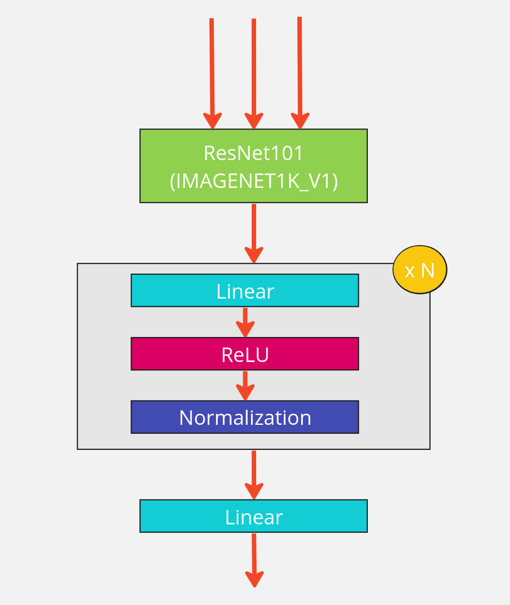
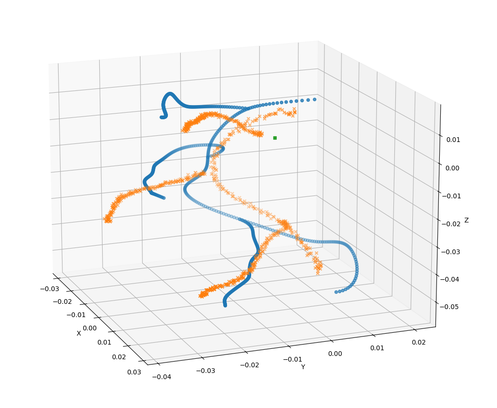

# CoronaryNet
Implementation of 
*Iyer, K., Nallamothu, B.K., Figueroa, C.A. et al., (2023). A multi-stage neural network approach for coronary 3D reconstruction from uncalibrated X-ray angiography images.*

## Dataset
Run [this script](https://github.com/kritiyer/vessel_tree_generator) with option --generate_projections
## Architecture

## Results
After 6 epochs (trained on GTX 970)

To be trained on better hardware